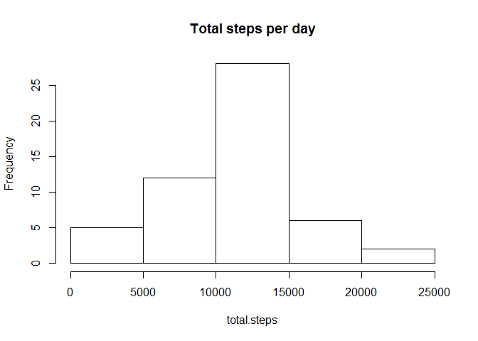
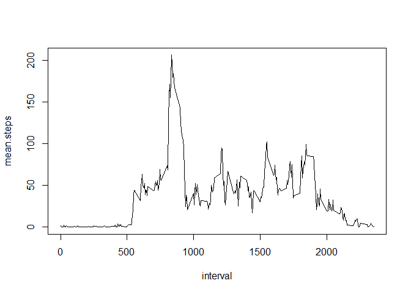
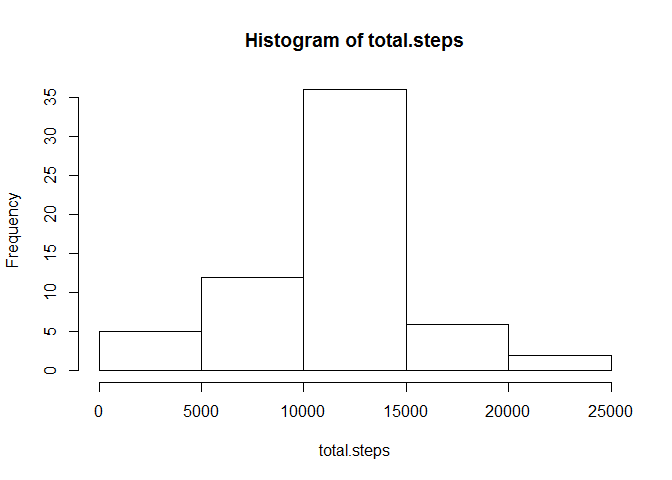
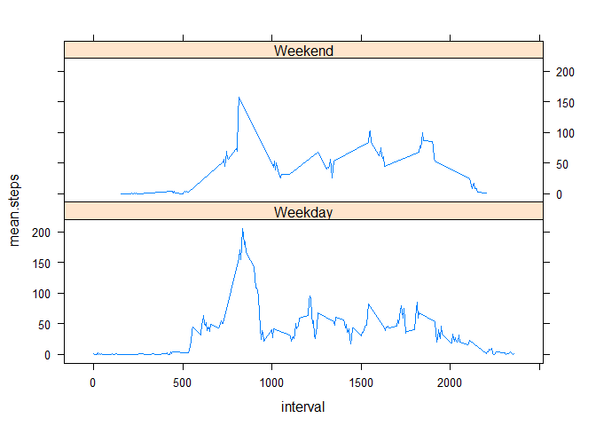

# Reproducible Research: Peer Assessment 1

## Data set

This assignment makes use of data from a personal activity monitoring device. This device collects data at 5 minute intervals through out the day. The data consists of two months of data from an anonymous individual collected during the months of October and November, 2012 and include the number of steps taken in 5 minute intervals each day. 

The variables included in this dataset are:
-steps: Number of steps taking in a 5-minute interval (missing values are coded as NA)
-date: The date on which the measurement was taken in YYYY-MM-DD format
-interval: Identifier for the 5-minute interval in which measurement was taken
 
The dataset is stored in a comma-separated-value (CSV) file and there are a total of 17,568 observations in this dataset.


## Loading and preprocessing the data

The code assumes that data is downloaded and unzipped into the working directory.


```r
#reading the data into data frame
activity <- read.csv("activity.csv", header=TRUE, stringsAsFactors = FALSE, sep=",")

#changing the column format to date type
activity$date <- as.Date(activity$date, "%Y-%m-%d")
```

## What is mean total number of steps taken per day?

For this part of the assignment, we are ignoring the missing values in the dataset.


```r
library(dplyr)
```

```
## 
## Attaching package: 'dplyr'
## 
## The following objects are masked from 'package:stats':
## 
##     filter, lag
## 
## The following objects are masked from 'package:base':
## 
##     intersect, setdiff, setequal, union
```

```r
steps_day <- summarise(group_by(activity, date), sum(steps))
names(steps_day) <- c("date","total.steps")
with(steps_day, hist(total.steps, main="Total steps per day"))
```

 

```r
mn <- mean(steps_day$total.steps, na.rm=T)
md <- median(steps_day$total.steps, na.rm=T)
```

Mean of the total number of steps taken per day is 1.0766189\times 10^{4} and the median is 1.0766189\times 10^{4}.


## What is the average daily activity pattern?

Average daily activity pattern can be seen on a time series plot of the 5-minute interval (x-axis) and the average number of steps taken, averaged across all days (y-axis).


```r
steps_int <- summarise(group_by(activity, interval), mean(steps, na.rm=T))
names(steps_int) <- c("interval","mean.steps")
with(steps_int, plot(interval, mean.steps, type="l"))
```

 

```r
maxst <- max(steps_int$mean.steps)
```

5-minute interval, on average across all the days in the dataset, which contains the maximum number of steps is 206.1698113.

## Imputing missing values

The total number of missing values in the original dataset is 2304. 
For next part of the assignment, missing values are replaced by mean for that 5-minute interval. 


```r
activity_full <- activity

# replace na's with mean for that interval
df0 <-  merge(activity_full, steps_int)
df0$steps[is.na(df0$steps)] <- df0$mean.steps[is.na(df0$steps)]

steps_full <- summarise(group_by(df0, date), sum(steps))
names(steps_full) <- c("date","total.steps")
```

Histogram of the total number of steps taken each day after missing values are imputed:


```r
with(steps_full, hist(total.steps))
```

 

```r
mn2 <- mean(steps_full$total.steps)
md2 <- median(steps_full$total.steps)
```

Mean is 1.0766189\times 10^{4} and median is 1.0766189\times 10^{4}. 

## Are there differences in activity patterns between weekdays and weekends?


```r
#create new factor variable with two levels - "weekday" and "weekend" indicating whether a given date is a weekday or weekend
df0$weekday<-weekdays(activity$date)
df0$weekend<-"Weekday"
df0$weekend[(df0$weekday=="Saturday" | df0$weekday=="Sunday")]<-"Weekend"
df0$weekend<-factor(df0$weekend)

#make a panel plot containing a time series plot (i.e. type = "l") of the 5-minute interval (x-axis) and the average number of steps taken, averaged across all weekday days or weekend days (y-axis)
library(lattice)
xyplot( mean.steps ~ interval | weekend, data=df0, type="l", layout=c(1,2))
```

 

Activities during weekdays are, as expected, differently distributed than during weekends. Activities during weekends are more evenly distributed, since during weekends people organize their activities during the whole day.

